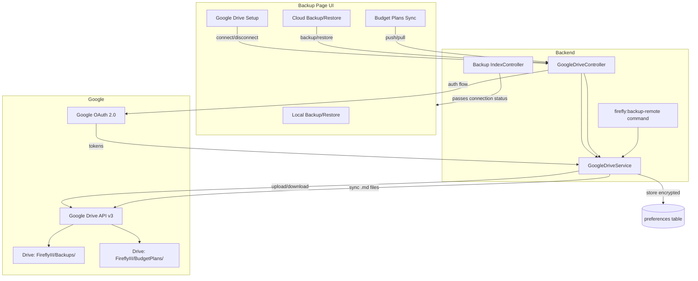

# Google Drive Cloud Sync for Backups and Budget Plans

## Why Google Drive over OneDrive

- Google Cloud Console is free, always accessible, and takes ~3 minutes to set up (vs Azure tenant issues)
- Official `google/apiclient` composer package handles OAuth, token refresh, and file uploads out of the box
- OAuth 2.0 Authorization Code flow works for personal Google accounts
- Refresh tokens auto-renew on every use (no 90-day expiry concern)

## One-Time Setup (User Side)

1. Go to [Google Cloud Console](https://console.cloud.google.com) > Create project > Enable "Google Drive API"
2. Create OAuth 2.0 credentials (Web application type), set redirect URI to `<app-url>/backup/google-drive/callback`
3. Put `GOOGLE_DRIVE_CLIENT_ID` and `GOOGLE_DRIVE_CLIENT_SECRET` in `.env`
4. In the Firefly III Backup page, click "Connect to Google Drive" -- one-time browser login

## Architecture




## Files to Create / Modify

### New Files

- `**config/google-drive.php**` -- Config file reading env vars, defining scopes and folder names
- `**app/Services/Internal/GoogleDriveService.php**` -- Core service: OAuth flow, token management, upload, download, list, sync
- `**app/Http/Controllers/Backup/GoogleDriveController.php**` -- Web controller for all cloud actions
- `**app/Console/Commands/Tools/BackupRemote.php**` -- `firefly:backup-remote` artisan command

### Modified Files

- `**[.env.example](.env.example)**` and `**[.env](.env)**` -- Add `GOOGLE_DRIVE_CLIENT_ID`, `GOOGLE_DRIVE_CLIENT_SECRET`, `GOOGLE_DRIVE_REDIRECT_URI`, `GOOGLE_DRIVE_BACKUP_FOLDER`, `GOOGLE_DRIVE_BUDGET_PLANS_FOLDER`
- `**[composer.json](composer.json)**` -- Add `google/apiclient` dependency
- `**[routes/web.php](routes/web.php)**` (lines 724-732) -- Add Google Drive routes in the backup group
- `**[app/Http/Controllers/Backup/IndexController.php](app/Http/Controllers/Backup/IndexController.php)**` -- Pass `googleDriveConnected` and `googleDriveConfigured` to view
- `**[resources/views/backup/index.twig](resources/views/backup/index.twig)**` -- Add 3 new sections: Cloud Setup, Cloud Backup/Restore, Budget Plans Sync
- `**[resources/lang/en_US/firefly.php](resources/lang/en_US/firefly.php)**` (after line 1711) -- Add translation strings

## Implementation Details

### 1. `config/google-drive.php`

```php
return [
    'client_id'            => env('GOOGLE_DRIVE_CLIENT_ID', ''),
    'client_secret'        => env('GOOGLE_DRIVE_CLIENT_SECRET', ''),
    'redirect_uri'         => env('GOOGLE_DRIVE_REDIRECT_URI', ''),
    'backup_folder'        => env('GOOGLE_DRIVE_BACKUP_FOLDER', 'FireflyIII/Backups'),
    'budget_plans_folder'  => env('GOOGLE_DRIVE_BUDGET_PLANS_FOLDER', 'FireflyIII/BudgetPlans'),
];
```

### 2. `GoogleDriveService` Key Methods

- `getAuthorizationUrl(): string` -- Build Google OAuth URL with `drive.file` scope + `offline` access type
- `handleCallback(string $code): void` -- Exchange auth code for tokens, store encrypted in preferences
- `isConnected(): bool` -- Check if valid tokens exist
- `disconnect(): void` -- Delete stored tokens
- `getClient(): Google_Client` -- Build authenticated client, auto-refresh expired tokens
- `uploadBackup(string $filePath): string` -- Upload .tar.gz to the backup folder, return file ID
- `listBackups(): array` -- List .tar.gz files in the backup folder
- `downloadBackup(string $fileId, string $destPath): void` -- Download backup file
- `deleteBackup(string $fileId): void` -- Delete a backup from Drive
- `pushBudgetPlans(): array` -- Upload all .md files from `storage/budget-plans/` to Drive
- `pullBudgetPlans(): array` -- Download all .md files from Drive to `storage/budget-plans/`

Token storage uses `app('preferences')->setEncrypted('google_drive_tokens', $tokens)` -- encrypted, per-user, consistent with existing patterns.

### 3. `GoogleDriveController` Routes


| Method | Path                                 | Action         | Description                   |
| ------ | ------------------------------------ | -------------- | ----------------------------- |
| GET    | `/backup/google-drive/connect`       | `connect`      | Redirect to Google OAuth      |
| GET    | `/backup/google-drive/callback`      | `callback`     | Handle OAuth callback         |
| POST   | `/backup/google-drive/disconnect`    | `disconnect`   | Remove connection             |
| POST   | `/backup/google-drive/backup`        | `backup`       | Create + upload backup        |
| GET    | `/backup/google-drive/files`         | `files`        | List remote backups (JSON)    |
| POST   | `/backup/google-drive/restore`       | `restore`      | Download + restore from Drive |
| POST   | `/backup/google-drive/delete-remote` | `deleteRemote` | Delete a remote backup        |
| POST   | `/backup/google-drive/push-plans`    | `pushPlans`    | Push budget plans to Drive    |
| POST   | `/backup/google-drive/pull-plans`    | `pullPlans`    | Pull budget plans from Drive  |


### 4. Updated Backup Page UI (`[backup/index.twig](resources/views/backup/index.twig)`)

The page gains 3 new rows below the existing local backup/restore:

**Row 2: Google Drive Setup** (full-width card)

- If `GOOGLE_DRIVE_CLIENT_ID` is empty: show instructions on how to set up Google Cloud Console credentials
- If configured but not connected: "Connect to Google Drive" button
- If connected: green status badge + "Disconnect" button

**Row 3: Cloud Backup / Cloud Restore** (two cards, side by side like the local ones)

- Left card: "Backup to Google Drive" button (creates backup + uploads)
- Right card: lists available remote backups in a table with "Restore" and "Delete" buttons per row. Loaded via AJAX from the `/files` endpoint.

**Row 4: Budget Plans Sync** (full-width card)

- Two buttons: "Push to Cloud" and "Pull from Cloud"
- Shows count of local vs remote files
- Warning text explaining that pull will overwrite local files

### 5. `firefly:backup-remote` Artisan Command

```
php artisan firefly:backup-remote
    {--user= : User ID whose Google Drive tokens to use (defaults to first admin)}
```

Runs the existing backup logic, then uploads the .tar.gz to Google Drive. Can be added to cron for automatic cloud backups.

### 6. Google Drive Folder Structure

```
My Drive/
  FireflyIII/
    Backups/
      firefly_backup_2026-02-26_142947.tar.gz
      firefly_backup_2026-02-25_100000.tar.gz
    BudgetPlans/
      MARCH_BUDGET_2026.md
      FEBRUARY_BUDGET_2026.md
```

Folders are created automatically on first upload using the Google Drive API's folder-creation endpoint.